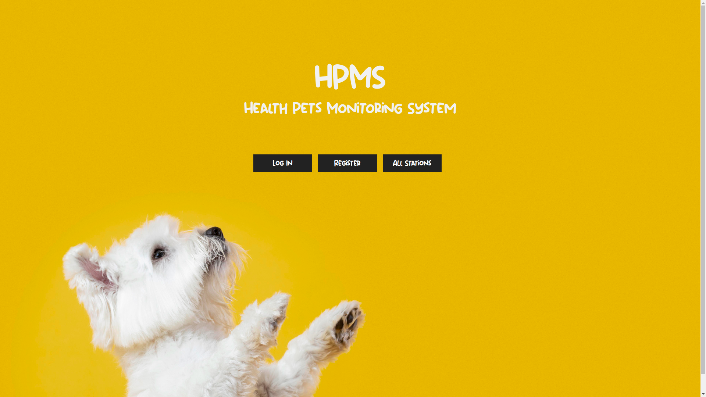

# HPMS: Health Pets Monitoring System
Sistema di monitoraggio della salute degli animali domestici con rilevazione di situazioni di pericolo all'interno del vicinato.

## Sito Web

## Presentazione
La presentazione usata per l'esposizione del progetto è reperibile mediante il seguente link:
[Health Pets Monitoring System](https://docs.google.com/presentation/d/1xayvDfFI8EZre74YQXk2f3XqVuServ13/edit?usp=sharing&ouid=107652794691641788775&rtpof=true&sd=true)

## TODO
Lista di funzioni da implementare:

### Arduino:
- [X] Modulo LoRa tra Food-Station e Collare
- [X] Termometro sul collare
- [X] Microfono sul collare
- [X] Battito cardiaco sul collare
- [X] Temporizzare il servo motore in base alla quantità di cibo fornita
- [X] Montaggio Food-Station
- [X] Montaggio Collare

### App:
- [X] Visualizzazione delle informazioni sulle Food-Station e sugli animali
- [X] Sistema di Login con password

### Bot Telegram:
- [X] Come App
- [X] Ricezione di un messaggio durante una situazione di allerta

### Sistema di Allerta:
- [X] Visualizzare le Food-Station con allerta
- [X] Visualizzare l'allerta in modo grafico

### Intelligenza artificiale:
- [X] Predizioni sull'andamento del peso del cane (eventualmente anche su altri valori)

### API:
- [X] Interazioni con i due digital twin

## Credits
L'idea di progetto nasce con la finalità di sostenere l'esame di IOT and 3D Intelligent Systems del professore Roberto Vezzani.
Realizzato da Michele Mosca, Giuseppe Orefice, Gaetano Orazio Cauchi e El Mehdi El Afia.